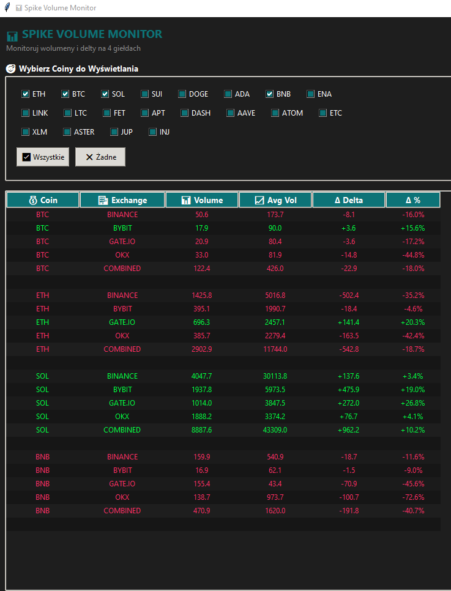
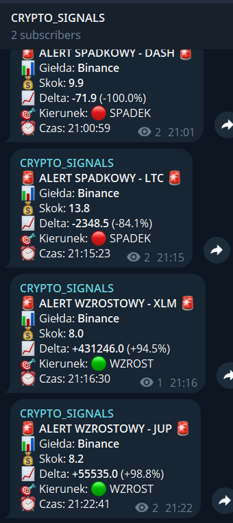

# Spike Volume Monitor


Narzędzie do monitorowania wolumenów i delt na wielu giełdach kryptowalut z systemem alertów na Telegram.

## Cechy

- **20 kryptowalut**: ETH, BTC, SOL, SUI, DOGE, ADA, BNB, ENA, LINK, LTC, FET, APT, DASH, AAVE, ATOM, ETC, XLM, ASTER, JUP, INJ
- **4 giełdy**: Binance (zawsze aktywny), Bybit, Gate.io, OKX (na żądanie)
- **Monitorowanie**: wolumen, delta (buy/sell), średnia historyczna
- **Alerty**: wysyłanie na Telegram przy spełnieniu warunków
- **GUI**: interfejs Tkinter do kontroli i monitorowania coinów
- **Asynchroniczny**: WebSockety z asyncio, wielowątkowy (GUI + event loop)

## Warunki Alertu (Binance)

1. **Wolumen > 7.5x średnia** z ostatnich 5 świec
2. **Delta >= 30%** dla świecy wzrostowej LUB **Delta <= -30%** dla świecy spadkowej
3. **Co najmniej 6 minut** danych historycznych

## Instalacja

```bash
# Utwórz virtual environment
python -m venv .venv

# Aktywuj (Windows)
.\.venv\Scripts\Activate.ps1

# Zainstaluj zależności
pip install -r requirements.txt
```

## Quick Start

1. Skopiuj szablon `.env` i uzupełnij wartości:

```powershell
Copy-Item .env.example .env
# Otwórz .env i wklej TELEGRAM_BOT_TOKEN oraz TELEGRAM_CHAT_ID
```

2. Aktywuj virtualenv i zainstaluj zależności (Windows PowerShell):

```powershell
.\.venv\Scripts\Activate.ps1
pip install -r requirements.txt
```

3. Uruchom aplikację:

```bash
python main.py
```

Po uruchomieniu powinno pojawić się okno GUI. Zaznacz coiny w panelu "Wybierz Coiny do Wyświetlania", żeby rozpocząć monitorowanie. Alerty na Telegram będą wysyłane automatycznie przy spełnieniu warunków (jeśli `.env` zawiera poprawne dane).


## Konfiguracja

### Plik środowiskowy `.env`

Przed uruchomieniem aplikacji skopiuj plik `.env.example` do `.env` i uzupełnij swoimi danymi:

```powershell
Copy-Item .env.example .env
# Następnie edytuj .env i wpisz swój TELEGRAM_BOT_TOKEN oraz TELEGRAM_CHAT_ID
```

**Uwaga:** Plik `.env` jest ignorowany przez git i nie powinien być commitowany do repozytorium.

### Telegram

Ustaw zmienne środowiskowe lub edytuj `.env`:
```powershell
$env:TELEGRAM_BOT_TOKEN = "twoj_bot_token"
$env:TELEGRAM_CHAT_ID = "twoj_chat_id"
```

Lub edytuj `config.py` i zamień wartości domyślne.

## Uruchomienie

```bash
python main.py
```

## Testowy GUI (.exe)

W repo znajduje się oddzielny folder z uproszczoną wersją GUI bez alertów Telegram: [gui_no_telegram_exe](gui_no_telegram_exe/).
Po zbudowaniu pliku exe wynik trafia do `gui_no_telegram_exe/dist/SpikeVolumeTest.exe`.

UWAGA: plik `.exe` jest do celów testowych — jeśli chcesz używać go produkcyjnie, rozważ podpisanie binarki i sprawdzenie zależności systemowych.

GUI pojawi się z pustym ekranem. Zaznacz coiny w panelu "Wybierz Coiny do Wyświetlania" aby zobaczyć dane i uruchomić monitoring 3 dodatkowych giełd dla każdego coina.

## Struktura Kodu

```
spike_volume/
├── config.py              # Parametry, URLs, tokeny, lista coinów
├── alerts.py              # Logika alertów Telegram
├── websockets_tasks.py    # WebSocket taski dla każdej giełdy
├── gui.py                 # Interfejs Tkinter
├── main.py                # Główny plik - event loop i uruchamianie
└── requirements.txt       # Zależności
```

### config.py
- Konfiguracja globalna (HISTORY, REFRESH_RATE, Telegram)
- Timeframes (TF_BINANCE, TF_BYBIT)
- WebSocket URLs
- Definicja 20 coinów z mapowaniem symboli dla każdej giełdy
- Funkcja `initialize_states()` - inicjalizacja stanu

### alerts.py
- `send_telegram_alert()` - wysyłanie wiadomości na Telegram
- `check_binance_alert()` - sprawdzanie warunków alertu

### websockets_tasks.py
**Binance (zawsze aktywne):**
- `kline_task_binance()` - monitorowanie świec
- `aggtrade_task_binance()` - monitorowanie transakcji (delta)

**Bybit (na żądanie):**
- `kline_task_bybit()` - świece
- `trade_task_bybit()` - transakcje

**Gate.io (na żądanie):**
- `trades_task_gate()` - transakcje
- `process_trade_gate()` - przetwarzanie pojedynczej transakcji

**OKX (na żądanie):**
- `trade_task_okx()` - transakcje

### gui.py
- `CryptoMonitorGUI` - klasa Tkinter GUI
  - Panel wyboru coinów (checkboxów)
  - Tabela danych z wolumenem, deltą, średnią
  - Przycisk "Wszystkie" / "Żadne"
  - Odświeżanie co 0.5s
  - Kolorowanie delty (zielony > 0, czerwony < 0)

### main.py
- `run_websockets()` - główna coroutine (Binance taski)
- `start_other_exchanges()` - uruchomienie 3 giełd dla coina
- `stop_other_exchanges()` - zatrzymanie 3 giełd dla coina
- `main()` - uruchomienie: event loop w wątku + GUI w głównym wątku

## Dane Wyświetlane

Dla każdego coina i giełdy:
- **Volume** - obecny wolumen świecy
- **Avg Volume** - średnia z ostatnich 5 świec
- **Delta** - różnica między buy a sell wolumenem
- **Delta %** - delta jako procent całkowitego wolumenu

**COMBINED** - suma wszystkich 4 giełd

## Notatki

- Binance zawsze zbiera dane w tle (co ~1 sekundę)
- Pozostałe giełdy uruchamiają się tylko gdy zaznaczysz coin w GUI
- Alerty wysyłane tylko na Telegram dla Binance (pozostałe giełdy tylko monitorowanie)
- GUI można minimalizować - aplikacja działa dalej
- Ctrl+C zamyka aplikację

## Screenshots

Przykładowe zrzuty ekranu z działającej aplikacji (pliki znajdują się w katalogu `assets/`).

- GUI aplikacji (tabela i panel wyboru coinów):

  

- Przykładowe alerty Telegram:

  

## Troubleshooting

**"Brak konfiguracji Telegram"**
- Ustaw zmienne środowiskowe lub edytuj `config.py`

**Błędy WebSocket**
- Aplikacja automatycznie reconnectuje co 5 sekund

**GUI się zawiesza**
- Event loop działa w osobnym wątku - to normalne, czekaj aż dane się załadują
